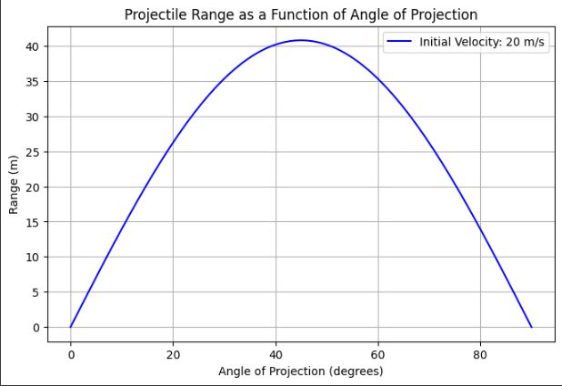

# Problem 1
# Investigating the Range as a Function of the Angle of Projection

## Motivation

Projectile motion, while seemingly simple, offers a rich playground for exploring fundamental principles of physics. The problem is straightforward: analyze how the range of a projectile depends on its angle of projection. Yet, beneath this simplicity lies a complex and versatile framework. The equations governing projectile motion involve both linear and quadratic relationships, making them accessible yet deeply insightful.

What makes this topic particularly compelling is the number of free parameters involved in these equations, such as initial velocity, gravitational acceleration, and launch height. These parameters give rise to a diverse set of solutions that can describe a wide array of real-world phenomena, from the arc of a soccer ball to the trajectory of a rocket.

## Task

### 1. Theoretical Foundation
- Begin by deriving the governing equations of motion from fundamental principles. This involves solving a basic differential equation to establish the general form of the motion.
- Highlight how variations in initial conditions lead to a family of solutions.

### 2. Analysis of the Range
- Investigate how the horizontal range depends on the angle of projection.
- Discuss how changes in other parameters, such as initial velocity and gravitational acceleration, influence the relationship.

### 3. Practical Applications
- Reflect on how this model can be adapted to describe various real-world situations, such as projectiles launched on uneven terrain or in the presence of air resistance.

### 4. Implementation
- Develop a computational tool or algorithm to simulate projectile motion.
- Visualize the range as a function of the angle of projection for different sets of initial conditions.

## Theoretical Solutions

The equations of motion governing projectile motion are given by:

\[
    x(t) = v_0 \cos(\theta) t
\]

\[
    y(t) = v_0 \sin(\theta) t - \frac{1}{2} g t^2
\]

The total time of flight is:

\[
    T = \frac{2 v_0 \sin(\theta)}{g}
\]

The range of the projectile is:

\[
    R = \frac{v_0^2 \sin(2\theta)}{g}
\]

The maximum height reached is:

\[
    H = \frac{v_0^2 \sin^2(\theta)}{2g}
\]

## Python Code for Simulation


```python
import numpy as np

def projectile_range(v0, theta, g=9.81):
    """Compute the range of a projectile given initial velocity and launch angle."""
    theta_rad = np.radians(theta)
    return (v0**2 * np.sin(2 * theta_rad)) / g

# Parameters
v0 = 20  # Initial velocity in m/s
theta_values = np.linspace(0, 90, num=100)  # Angle range from 0 to 90 degrees
ranges = [projectile_range(v0, theta) for theta in theta_values]
```

## Deliverables

1. A Markdown document with Python script or notebook implementing the simulations.
2. A detailed description of the family of solutions derived from the governing equations.
3. Graphical representations of the range versus angle of projection, highlighting how different parameters influence the curve.
4. A discussion on the limitations of the idealized model and suggestions for incorporating more realistic factors, such as drag or wind.

## Hints and Resources

- Start from the fundamental laws of motion and gradually build the general solution.
- Use numerical methods or simulation tools to explore scenarios that go beyond simple analytical solutions.
- Consider how this model connects to real-world systems, such as sports, engineering, and astrophysics.

This task encourages a deep understanding of projectile motion while showcasing its versatility and applicability across various domains.
