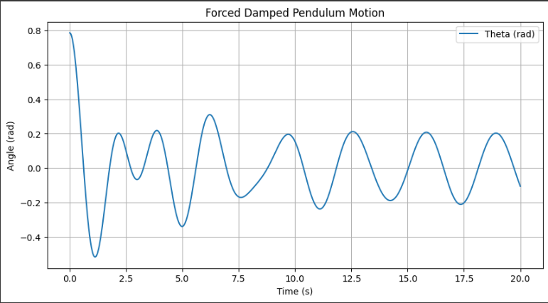

# Problem 2
# Investigating the Dynamics of a Forced Damped Pendulum

## Motivation
The forced damped pendulum is an intriguing physical system exhibiting complex behaviors due to the interplay of damping, restoring forces, and external periodic forcing. By introducing both damping and external forcing, the system transitions from simple harmonic motion to a spectrum of dynamics, including resonance, chaos, and quasiperiodic motion. These phenomena help in understanding real-world applications such as driven oscillators, climate systems, and mechanical structures under periodic stress.

Forcing introduces new parameters, such as amplitude and frequency of the external force, significantly influencing the pendulum’s behavior. By systematically varying these parameters, diverse solutions emerge, including synchronized oscillations, chaotic motion, and resonance phenomena. These behaviors not only highlight fundamental physics principles but also provide insights into engineering applications like energy harvesting, vibration isolation, and mechanical resonance.

---

## Task

### 1. Theoretical Foundation
- Consider the differential equation governing the forced damped pendulum:
  
  $$ \frac{d^2 \theta}{dt^2} + b \frac{d \theta}{dt} + \frac{g}{L} \sin(\theta) = A \cos(\omega t) $$
  
- Derive approximate solutions for small-angle oscillations.
- Explore resonance conditions and their impact on the system’s energy.

### 2. Analysis of Dynamics
- Investigate how the damping coefficient, driving amplitude, and frequency affect the pendulum’s motion.
- Examine the transition between regular and chaotic motion and its physical interpretations.

### 3. Practical Applications
- Discuss real-world applications of the forced damped pendulum, such as energy harvesting devices, suspension bridges, and oscillating circuits.

### 4. Implementation
- Develop a computational model to simulate the motion of the forced damped pendulum.
- Visualize behavior under various damping, driving forces, and initial conditions.
- Plot phase diagrams and Poincaré sections to illustrate transitions to chaos.

---

## Implementation in Python
()
Below is a Python implementation using numerical methods to solve the forced damped pendulum equation and visualize its behavior.

```python
import numpy as np
import matplotlib.pyplot as plt
from scipy.integrate import solve_ivp

# Parameters
g = 9.81  # Gravity (m/s^2)
L = 1.0   # Length of pendulum (m)
b = 0.5   # Damping coefficient
A = 1.2   # Driving force amplitude
omega = 2.0  # Driving force frequency

# Differential equation
def forced_damped_pendulum(t, y):
    theta, omega_t = y
    dtheta_dt = omega_t
    domega_dt = - (g / L) * np.sin(theta) - b * omega_t + A * np.cos(omega * t)
    return [dtheta_dt, domega_dt]

# Time span and initial conditions
t_span = (0, 20)
t_eval = np.linspace(*t_span, 1000)
y0 = [np.pi / 4, 0]  # Initial angle and angular velocity

# Solve the differential equation
sol = solve_ivp(forced_damped_pendulum, t_span, y0, t_eval=t_eval, method='RK45')

# Plot results
plt.figure(figsize=(10, 5))
plt.plot(sol.t, sol.y[0], label='Theta (rad)')
plt.xlabel('Time (s)')
plt.ylabel('Angle (rad)')
plt.title('Forced Damped Pendulum Motion')
plt.legend()
plt.grid()
plt.show()
```

This code numerically solves the forced damped pendulum equation and visualizes the pendulum's motion over time. 

---

## Deliverables
1. A Markdown document with a Python script implementing the simulations.
2. A detailed explanation of the general solutions for the forced damped pendulum.
3. Graphical representations of the motion for different damping coefficients, driving amplitudes, and frequencies, including resonance and chaotic behavior.
4. A discussion on model limitations and potential extensions, such as nonlinear damping or non-periodic driving forces.
5. Phase portraits, Poincaré sections, and bifurcation diagrams to analyze transitions to complex dynamics.

---

## Hints and Resources
- For small angles, approximate \( \sin \theta \approx \theta \) to simplify the equation.
- Use numerical techniques (e.g., Runge-Kutta methods) to explore dynamics beyond the small-angle approximation.
- Relate the forced damped pendulum to analogous systems in other fields, such as electrical circuits (driven RLC circuits) or biomechanics (human gait).
- Utilize software tools like Python for simulations and visualizations.

This task bridges theoretical analysis with computational exploration, fostering a deeper understanding of forced and damped oscillatory phenomena and their implications in physics and engineering.
