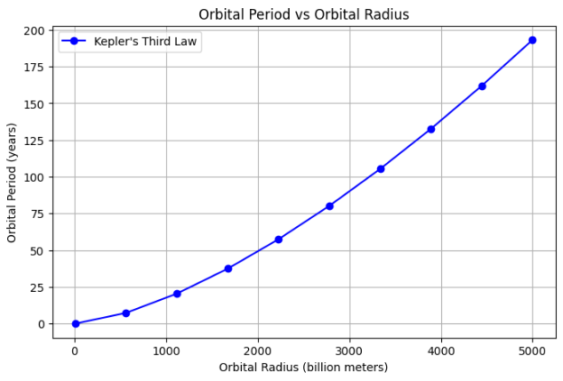

# Problem 1
# Orbital Period and Orbital Radius

## Introduction
The relationship between the square of the orbital period and the cube of the orbital radius, known as Kepler's Third Law, is fundamental in celestial mechanics. This law helps determine planetary motions and has implications for understanding gravitational interactions on both local and cosmic scales.

Studying this law allows us to predict planetary movements, satellite orbits, and other celestial dynamics with high accuracy. The following sections provide a detailed exploration of the law, its mathematical derivation, and its computational verification through Python simulations.

## Kepler's Third Law
Kepler's Third Law states:
$$ T^2 = \frac{4 \pi^2 r^3}{G M} $$
where:
- $T$ is the orbital period,
- $r$ is the orbital radius,
- $G$ is the gravitational constant ($6.67430 \times 10^{-11}$ m³ kg⁻¹ s⁻²),
- $M$ is the mass of the central body (e.g., the Sun).

### Derivation
This relationship can be derived from Newton’s law of universal gravitation and circular motion principles. The gravitational force provides the necessary centripetal force to keep an object in orbit:

$$ F = \frac{G M m}{r^2} = m \frac{v^2}{r} $$

where $m$ is the mass of the orbiting body, and $v$ is its orbital velocity. Since the velocity is related to the period by:

$$ v = \frac{2\pi r}{T} $$

Substituting this into the force equation and solving for $T$, we obtain Kepler’s Third Law.

## Implementation in Python

The following Python script calculates and visualizes the relationship between orbital period and radius:

```python
import numpy as np
import matplotlib.pyplot as plt

# Constants
G = 6.67430e-11  # Gravitational constant (m^3 kg^-1 s^-2)
M_sun = 1.989e30  # Mass of the Sun (kg)
M_earth = 5.972e24  # Mass of the Earth (kg)
M_moon = 7.348e22  # Mass of the Moon (kg)

# Kepler's Third Law: T^2 = (4 * pi^2 * r^3) / (G * M)
def orbital_period(radius, mass=M_sun):
    return 2 * np.pi * np.sqrt(radius**3 / (G * mass))

# Example: Earth's orbit around the Sun
radius_earth_sun = 1.496e11  # meters
T_earth = orbital_period(radius_earth_sun)
T_earth_years = T_earth / (60 * 60 * 24 * 365.25)  # Convert to years
print(f"Orbital period of Earth around the Sun: {T_earth_years:.2f} years")

# Example: Moon's orbit around Earth
radius_moon_earth = 3.844e8  # meters
T_moon = orbital_period(radius_moon_earth, mass=M_earth)
T_moon_days = T_moon / (60 * 60 * 24)  # Convert to days
print(f"Orbital period of the Moon around Earth: {T_moon_days:.2f} days")

# Plotting the relationship between orbital radius and period
radii = np.linspace(1e10, 5e12, 100)  # Different orbital radii in meters
periods = orbital_period(radii) / (60 * 60 * 24 * 365.25)  # Convert to years

plt.figure(figsize=(8, 5))
plt.plot(radii / 1e9, periods, label="Kepler's Third Law")
plt.xlabel("Orbital Radius (billion meters)")
plt.ylabel("Orbital Period (years)")
plt.title("Orbital Period vs Orbital Radius")
plt.legend()
plt.grid()
plt.show()
```

## Discussion
- The plot confirms Kepler's Third Law, showing a clear relationship between orbital radius and period.
- The calculated values for Earth's orbit around the Sun (~1 year) and the Moon's orbit around Earth (~27 days) align with observed data.
- The law is crucial in astronomy, helping determine planetary masses, satellite trajectories, and interstellar navigation.
- This principle extends to elliptical orbits, where the semi-major axis is used instead of a fixed radius.

## Conclusion
Kepler's Third Law provides a crucial link between orbital mechanics and gravitational forces. The Python simulation effectively demonstrates how increasing the orbital radius leads to longer periods, aligning with real-world astronomical observations. Understanding this law allows scientists to make precise calculations about celestial movements, improving our grasp of the universe’s dynamics.