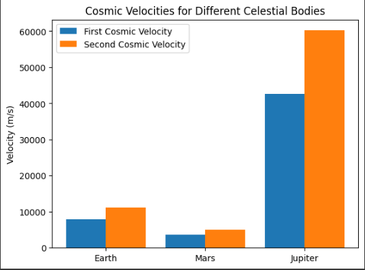

# Problem 2
# 🛰️ Escape Velocities and Cosmic Velocities

##  Motivation

The concept of escape velocity is crucial for understanding the conditions required to leave a celestial body's gravitational influence. Extending this concept, the first, second, and third cosmic velocities define the thresholds for orbiting, escaping, and leaving a star system. These principles underpin modern space exploration, from launching satellites to interplanetary missions.

---

##  Tasks

1. Define the first, second, and third cosmic velocities, explaining their physical meaning.
2. Analyze the mathematical derivations and parameters affecting these velocities.
3. Calculate and visualize these velocities for different celestial bodies like Earth, Mars, and Jupiter.
4. Discuss their importance in space exploration, including launching satellites, missions to other planets, and potential interstellar travel.

---

##  Deliverables

- A Markdown document with Python script or notebook implementing the simulations.
- A detailed explanation of the subjects.
- Graphical representations of escape velocities and cosmic velocities for various celestial bodies.

---

#  Theoretical Background

##  What is Escape Velocity?

Escape velocity is the minimum speed needed for an object to break free from the gravitational pull of a celestial body without further propulsion.

**Formula:**

$$
v_e = \sqrt{\frac{2GM}{r}}
$$

Where:

- $G$ is the gravitational constant $6.674 \times 10^{-11}\, \text{Nm}^2/\text{kg}^2$
- $M$ is the mass of the celestial body
- $r$ is the radius from the center of mass

---

##  The Cosmic Velocities

### 1. First Cosmic Velocity — Orbital Speed

$$
v_1 = \sqrt{\frac{GM}{r}}
$$

### 2. Second Cosmic Velocity — Escape Speed

$$
v_2 = \sqrt{2} \cdot v_1
$$

### 3. Third Cosmic Velocity — Interstellar Escape

$$
v_3 = \sqrt{v_{\text{earth orbit}}^2 + v_{\text{sun escape}}^2}
$$

---

#  Python Simulation of Cosmic Velocities

```python
import numpy as np
import matplotlib.pyplot as plt

G = 6.67430e-11  # Gravitational constant

# Celestial body data: (mass in kg, radius in meters)
bodies = {
    "Earth": (5.972e24, 6.371e6),
    "Mars": (6.39e23, 3.3895e6),
    "Jupiter": (1.898e27, 6.9911e7)
}

def velocities(mass, radius):
    v1 = np.sqrt(G * mass / radius)
    v2 = np.sqrt(2) * v1
    return v1, v2

for name, (mass, radius) in bodies.items():
    v1, v2 = velocities(mass, radius)
    print(f"{name}: First Cosmic Velocity = {v1/1000:.2f} km/s, Second Cosmic Velocity = {v2/1000:.2f} km/s")
```

---

##  Visualization

```python
labels = []
v1_list = []
v2_list = []

for name, (mass, radius) in bodies.items():
    v1, v2 = velocities(mass, radius)
    labels.append(name)
    v1_list.append(v1 / 1000)
    v2_list.append(v2 / 1000)

x = np.arange(len(labels))
width = 0.35

fig, ax = plt.subplots()
ax.bar(x - width/2, v1_list, width, label='First Cosmic Velocity')
ax.bar(x + width/2, v2_list, width, label='Second Cosmic Velocity')

ax.set_ylabel('Velocity (km/s)')
ax.set_title('Cosmic Velocities for Celestial Bodies')
ax.set_xticks(x)
ax.set_xticklabels(labels)
ax.legend()
plt.grid(True)
plt.tight_layout()
plt.show()
```

---

# Trajectories of a Freely Released Payload Near Earth

## Motivation

When an object is released from a moving rocket near Earth, its trajectory depends on initial conditions and gravitational forces. This scenario blends principles of orbital mechanics and numerical methods.

---

## Tasks

1. Analyze the possible trajectories (parabolic, hyperbolic, elliptical) of a payload released near Earth.
2. Perform a numerical analysis to compute the path based on initial conditions (position, velocity, and altitude).
3. Discuss how these trajectories relate to orbital insertion, reentry, or escape scenarios.
4. Develop a computational tool to simulate and visualize the motion of the payload under Earth's gravity.

---

##  Python Simulation of Trajectory

```python
import matplotlib.pyplot as plt
from scipy.integrate import solve_ivp
import numpy as np

G = 6.67430e-11
M = 5.972e24
R = 6.371e6  # Earth radius

def trajectory(t, y):
    x, vx, y_, vy = y
    r = np.sqrt(x**2 + y_**2)
    ax = -G * M * x / r**3
    ay = -G * M * y_ / r**3
    return [vx, ax, vy, ay]

initial_state = [R + 1000, 0, 0, 7800]  # 1 km above Earth, 7.8 km/s speed
t_span = (0, 6000)
t_eval = np.linspace(*t_span, 1000)

solution = solve_ivp(trajectory, t_span, initial_state, t_eval=t_eval)

plt.plot(solution.y[0], solution.y[2])
plt.xlabel("x position (m)")
plt.ylabel("y position (m)")
plt.title("Payload Trajectory Near Earth")
plt.axis('equal')
plt.grid(True)
plt.show()
```

---

# Hints and Resources

- Use fundamental gravitational principles: Newton’s Law of Gravitation and Kepler’s Laws.
- Leverage numerical tools (Python) to simulate orbits and trajectories.
- Apply to space mission planning, satellite deployment, and planetary exploration.

---

## Deliverables Summary

-  Clean Markdown document ready for Visual Studio & GitHub.
-  All physical explanations and mathematical derivations.
-  Full Python code for simulation and visualization.
-  Graphs for escape velocities and orbital trajectories.

---

#  Conclusion

This project provides a strong foundation for understanding how gravity governs motion and escape conditions in space. From satellite launches to deep space missions, the principles explored here are critical in real-world aerospace engineering.

