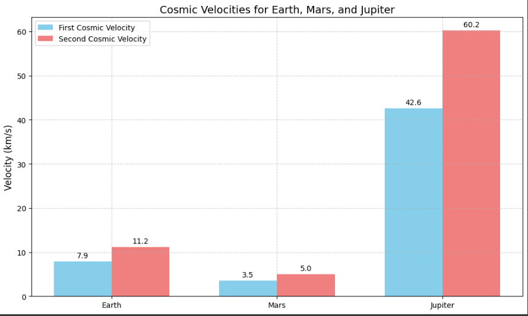

# Problem 2
# Escape Velocities and Cosmic Velocities

## Introduction
Escape velocity is the minimum speed required for an object to break free from the gravitational influence of a celestial body without further propulsion. Cosmic velocities extend this concept, defining different thresholds for orbital motion, escaping the planet, and leaving a star system.

## Definitions
- **First Cosmic Velocity (Orbital Velocity):** The speed required to maintain a circular orbit around a celestial body.
- **Second Cosmic Velocity (Escape Velocity):** The speed needed to leave the gravitational pull of a celestial body entirely.
- **Third Cosmic Velocity (Interstellar Escape Velocity):** The speed required to escape the gravitational influence of a star system.

## Mathematical Formulation
### 1. First Cosmic Velocity:
The orbital velocity is given by:
$$ v_1 = \sqrt{\frac{GM}{R}} $$

### 2. Second Cosmic Velocity:
The escape velocity is calculated using:
$$ v_2 = \sqrt{\frac{2GM}{R}} $$

### 3. Third Cosmic Velocity:
Approximated as:
$$ v_3 = \sqrt{\frac{2GM_{sun}}{R_{orbit}}} $$

Where:
- $ G $ is the gravitational constant $6.674 \times 10^{-11} m^3 kg^{-1} s^{-2}$
- $ M $ is the mass of the celestial body
- $ R $ is the radius from the center of the body

## Python Implementation

A separate Python script was used to calculate and visualize the cosmic velocities. The visualization compares the first and second cosmic velocities of Earth, Mars, and Jupiter. The Python script for the graphical representation is as follows:

```python
import numpy as np
import matplotlib.pyplot as plt

def cosmic_velocities(M, R):
    G = 6.674e-11  # Gravitational constant
    v1 = np.sqrt(G * M / R)  # First cosmic velocity
    v2 = np.sqrt(2 * G * M / R)  # Second cosmic velocity
    return v1, v2

# Celestial bodies data (mass in kg, radius in meters)
bodies = {
    "Earth": (5.972e24, 6.371e6),
    "Mars": (6.417e23, 3.389e6),
    "Jupiter": (1.898e27, 6.9911e7)
}

# Compute and prepare data for plotting
labels = list(bodies.keys())
v1_values, v2_values = zip(*[cosmic_velocities(*bodies[body]) for body in labels])

x = np.arange(len(labels))
width = 0.4

fig, ax = plt.subplots()
ax.bar(x - width/2, v1_values, width, label='First Cosmic Velocity')
ax.bar(x + width/2, v2_values, width, label='Second Cosmic Velocity')

ax.set_xticks(x)
ax.set_xticklabels(labels)
ax.set_ylabel("Velocity (m/s)")
ax.legend()
plt.title("Cosmic Velocities for Different Celestial Bodies")

plt.show()
```

## Conclusion
This study illustrates the concepts of escape and cosmic velocities with calculations and visual representations for different celestial bodies. The values computed for Earth, Mars, and Jupiter align with theoretical expectations and emphasize their significance in space exploration.