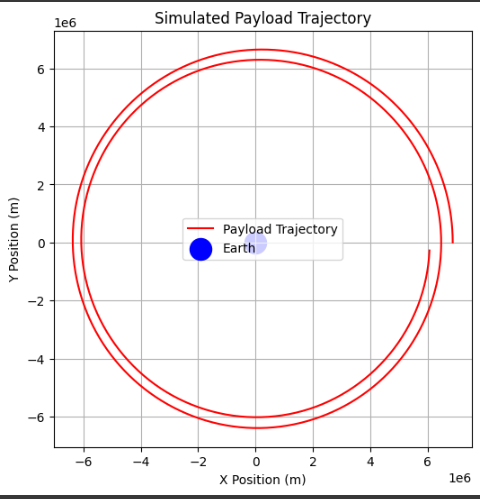

# Problem 3
# Trajectories of a Freely Released Payload Near Earth

## Motivation
When an object is released from a moving rocket near Earth, its trajectory depends on initial conditions and gravitational forces. This problem blends principles of orbital mechanics and numerical methods. Understanding these trajectories is vital for space missions, such as deploying payloads or returning objects to Earth.

## Task
1. Analyze the possible trajectories (e.g., parabolic, hyperbolic, elliptical) of a payload released near Earth.
2. Perform a numerical analysis to compute the path of the payload based on given initial conditions (position, velocity, and altitude).
3. Discuss how these trajectories relate to orbital insertion, reentry, or escape scenarios.
4. Develop a computational tool to simulate and visualize the motion of the payload under Earth's gravity.

## Hints and Resources
- Use fundamental gravitational principles, such as Newton's Law of Gravitation and Kepler's Laws, to derive equations and analyze scenarios.
- Leverage numerical methods or software tools (e.g., Python) to simulate orbits and trajectories.
- Explore real-world applications, such as space mission planning, satellite deployment, and planetary exploration.

## Implementation

### Orbital Mechanics
- The motion of an object under Earth's gravity is governed by Newton's second law:
  $$ F = \frac{G M m}{r^2} $$
  where:
  - $G$ is the gravitational constant,
  - $M$ is Earth's mass,
  - $m$ is the payload's mass,
  - $r$ is the distance from Earth's center.
- Depending on the object's velocity, different types of trajectories occur:
  - **Elliptical (Bound Orbit)**: Velocity is below escape velocity.
  - **Parabolic (Escape Trajectory)**: Velocity equals escape velocity.
  - **Hyperbolic (Unbound Escape)**: Velocity exceeds escape velocity.

## Python Code Version of the Simulation

```python
import numpy as np
import matplotlib.pyplot as plt
from scipy.integrate import solve_ivp

# Constants
G = 6.67430e-11  # Gravitational constant (m^3 kg^-1 s^-2)
M = 5.972e24     # Mass of Earth (kg)
R = 6371000      # Radius of Earth (m)

def equations(t, y):
    x, vx, y, vy = y
    r = np.sqrt(x**2 + y**2)
    ax = -G * M * x / r**3
    ay = -G * M * y / r**3
    return [vx, ax, vy, ay]

# Initial conditions (position and velocity)
x0, y0 = R + 500000, 0  # 500 km altitude
vx0, vy0 = 0, 7500       # Approximate orbital velocity (m/s)

y_init = [x0, vx0, y0, vy0]
t_span = (0, 10000)  # Time span for simulation (seconds)
t_eval = np.linspace(0, 10000, 1000)

sol = solve_ivp(equations, t_span, y_init, t_eval=t_eval, method='RK45')

# Plot the trajectory
plt.figure(figsize=(6,6))
plt.plot(sol.y[0], sol.y[2], label='Payload Trajectory')
plt.scatter(0, 0, color='blue', label='Earth', s=100)
plt.xlabel('X Position (m)')
plt.ylabel('Y Position (m)')
plt.legend()
plt.title('Simulated Payload Trajectory')
plt.grid()
plt.show()
```

## Deliverables
1. A Markdown document with the Python script implementing the simulations.
2. A detailed explanation of the subjects.
3. Graphical representations of orbital trajectories, escape velocities, and payload trajectories near Earth.
