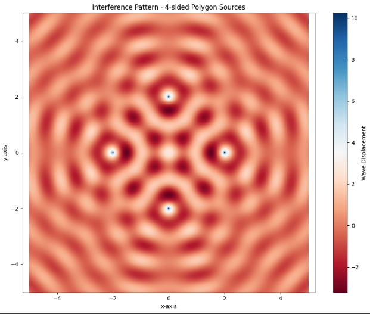

# Problem 1

#  Interference Patterns on a Water Surface

##  Motivation

Interference occurs when waves from different sources overlap, creating new patterns. On a water surface, this can be easily observed when ripples from different points meet, forming unique interference patterns. These patterns can show us how waves combine in different ways, either reinforcing each other or canceling out.

Studying these patterns helps us understand wave behavior in a simple, visual way. It also allows us to explore important concepts, like the relationship between wave phase and the effects of multiple sources. This task offers a hands-on approach to learning about wave interactions and their real-world applications, making it an interesting and engaging way to dive into wave physics.

---

## Task

A circular wave on the water surface, emanating from a point source located at $(x_0, y_0)$, is described by the Single Disturbance Equation:

$$
\eta(x, y, t) = \frac{A}{\sqrt{r}} \cdot \cos(kr - \omega t + \phi)
$$

Where:

- $\eta(x, y, t)$ is the displacement of the water surface at point $(x, y)$ and time $t$.
- $A$ is the amplitude of the wave.
- $k = \frac{2\pi}{\lambda}$ is the wave number, related to the wavelength $\lambda$.
- $\omega = 2\pi f$ is the angular frequency, related to the frequency $f$.
- $r = \sqrt{(x - x_0)^2 + (y - y_0)^2}$ is the distance from the source to the point $(x, y)$.
- $\phi$ is the initial phase.

---

## Problem Statement

Your task is to analyze the interference patterns formed on the water surface due to the superposition of waves emitted from point sources placed at the vertices of a chosen regular polygon.

---

## Steps to Follow

1. **Select a Regular Polygon**  
   Choose a regular polygon (e.g., equilateral triangle, square, regular pentagon).

2. **Position the Sources**  
   Place point wave sources at the vertices of the selected polygon.

3. **Wave Equations**  
   Write the equations describing the waves emitted from each source, considering their respective positions.

4. **Superposition of Waves**  
   Apply the principle of superposition by summing the wave displacements at each point on the water surface:

   $$
   \eta_{\text{sum}}(x, y, t) = \sum_{i=1}^{N} \eta_i(x, y, t)
   $$

   Where $N$ is the number of sources (vertices of the polygon).

5. **Analyze Interference Patterns**  
   Examine the resulting displacement $\eta_{\text{sum}}(x, y, t)$ as a function of position $(x, y)$ and time $t$. Identify regions of:
   - Constructive interference (wave amplification)
   - Destructive interference (wave cancellation)

6. **Visualization**  
   Present your findings graphically, illustrating the interference patterns for the chosen regular polygon.

---

## Considerations

- Assume all sources emit waves with the same amplitude $A$, wavelength $\lambda$, and frequency $f$.
- The waves are coherent, maintaining a constant phase difference.
- You may use simulation and visualization tools such as **Python** (with libraries like `matplotlib`, `numpy`), or other graphical software to aid in your analysis.

---

## Python Implementation

```python
# Interference Patterns on a Water Surface (Regular Polygon Configuration)

import numpy as np
import matplotlib.pyplot as plt

# Wave Parameters
A = 1         # Amplitude
λ = 1         # Wavelength
k = 2 * np.pi / λ
f = 1         # Frequency
ω = 2 * np.pi * f
φ = 0         # Initial Phase
t = 0         # Time snapshot

# Simulation Grid
x = np.linspace(-5, 5, 500)
y = np.linspace(-5, 5, 500)
X, Y = np.meshgrid(x, y)

# Regular Polygon Parameters (e.g., square)
N = 4  # Number of vertices
radius = 2
center = (0, 0)

# Calculate Polygon Vertices
angles = np.linspace(0, 2 * np.pi, N, endpoint=False)
sources = [(center[0] + radius * np.cos(a), center[1] + radius * np.sin(a)) for a in angles]

# Calculate Total Wave Displacement
η_sum = np.zeros_like(X)

for (x0, y0) in sources:
    r = np.sqrt((X - x0)**2 + (Y - y0)**2)
    η = A / np.sqrt(r + 1e-6) * np.cos(k * r - ω * t + φ)
    η_sum += η

# Plotting the Interference Pattern
plt.figure(figsize=(8, 6))
plt.pcolormesh(X, Y, η_sum, shading='auto', cmap='seismic')
plt.colorbar(label='Displacement')
plt.title('Interference Pattern on a Water Surface (Square Configuration)')
plt.xlabel('x')
plt.ylabel('y')
plt.axis('equal')
plt.tight_layout()
plt.show()
