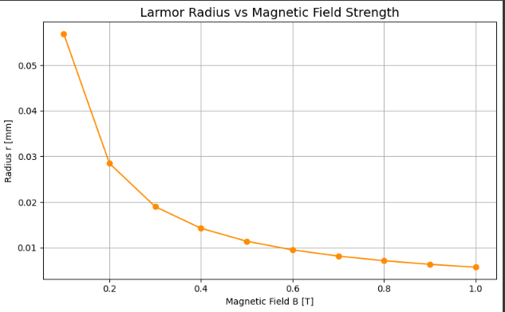

# Problem 1
# Lorentz Force Simulation

## Motivation

The Lorentz force, expressed as $\mathbf{F} = q\mathbf{E} + q\mathbf{v} \times \mathbf{B}$, governs the motion of charged particles in electric and magnetic fields. It is foundational in fields like plasma physics, particle accelerators, and astrophysics. By focusing on simulations, we can explore the practical applications and visualize the complex trajectories that arise due to this force.

## Task

### 1. Exploration of Applications
- Identify systems where the Lorentz force plays a key role (e.g., particle accelerators, mass spectrometers, plasma confinement).
- Discuss the relevance of electric ($\mathbf{E}$) and magnetic ($\mathbf{B}$) fields in controlling the motion of charged particles.

### 2. Simulating Particle Motion
- Implement a simulation to compute and visualize the trajectory of a charged particle under:
  - A uniform magnetic field.
  - Combined uniform electric and magnetic fields.
  - Crossed electric and magnetic fields.
- Simulate the particle's circular, helical, or drift motion based on initial conditions and field configurations.

### 3. Parameter Exploration
- Allow variations in:
  - Field strengths ($\mathbf{E}, \mathbf{B}$).
  - Initial particle velocity ($\mathbf{v}$).
  - Charge and mass of the particle ($q, m$).
- Observe how these parameters influence the trajectory.

### 4. Visualization
- Create clear, labeled plots showing the particle's path in 2D and 3D for different scenarios.
- Highlight physical phenomena such as the Larmor radius and drift velocity.

## Hints and Resources
- Use numerical methods like the Euler or Runge-Kutta method to solve the equations of motion.
- Employ Python libraries such as NumPy for calculations and Matplotlib for visualizations.
- Start with simple cases (e.g., uniform magnetic field) and gradually add complexity (e.g., crossed fields).

---

## Python Simulation


```python
import numpy as np
import matplotlib.pyplot as plt
from mpl_toolkits.mplot3d import Axes3D

# Constants and initial conditions
q = 1.6e-19      # Charge (C)
m = 9.1e-31      # Mass (kg)
E = np.array([0, 0, 0])    # Electric field (V/m)
B = np.array([0, 0, 1])    # Magnetic field (T)
v0 = np.array([1e6, 0, 0]) # Initial velocity (m/s)
r0 = np.array([0, 0, 0])   # Initial position (m)
dt = 1e-11                 # Time step (s)
steps = 1000

# Arrays to store position and velocity
r = np.zeros((steps, 3))
v = np.zeros((steps, 3))
r[0] = r0
v[0] = v0

# Runge-Kutta 4th Order Method
for i in range(steps - 1):
    def acceleration(v):
        return (q/m) * (E + np.cross(v, B))

    k1v = dt * acceleration(v[i])
    k1r = dt * v[i]

    k2v = dt * acceleration(v[i] + 0.5 * k1v)
    k2r = dt * (v[i] + 0.5 * k1v)

    k3v = dt * acceleration(v[i] + 0.5 * k2v)
    k3r = dt * (v[i] + 0.5 * k2v)

    k4v = dt * acceleration(v[i] + k3v)
    k4r = dt * (v[i] + k3v)

    v[i+1] = v[i] + (k1v + 2*k2v + 2*k3v + k4v) / 6
    r[i+1] = r[i] + (k1r + 2*k2r + 2*k3r + k4r) / 6

# Visualization
fig = plt.figure(figsize=(10, 6))
ax = fig.add_subplot(111, projection='3d')
ax.plot(r[:,0], r[:,1], r[:,2], label='Particle Trajectory')
ax.set_xlabel('x (m)')
ax.set_ylabel('y (m)')
ax.set_zlabel('z (m)')
ax.set_title('Lorentz Force Simulation')
ax.legend()
plt.tight_layout()
plt.show()
```

---

## Discussion
- The simulation illustrates how charged particles move in predictable patterns under various electromagnetic field configurations.
- Circular motion arises in uniform magnetic fields due to the perpendicular velocity.
- Adding electric fields introduces drift or acceleration along the field direction.
- Applications include particle cyclotrons, magnetic confinement in fusion devices, and cosmic ray deflection in space.

---

## Suggestions for Extension
- Add support for non-uniform fields using spatially varying functions for $\mathbf{E}$ and $\mathbf{B}$.
- Include relativistic effects for very high-speed particles.
- Incorporate collisions or damping forces for more realistic modeling in plasma environments.

---
