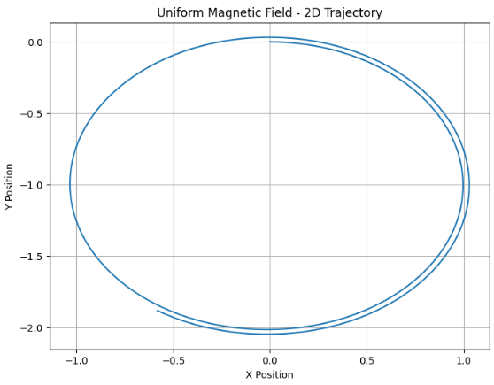

# Problem 1

# Simulating the Effects of the Lorentz Force

---

## Motivation

The Lorentz force is fundamental in understanding how charged particles move under electric and magnetic fields. It plays a crucial role in many areas of physics including plasma physics, particle accelerators, and astrophysics. By simulating the Lorentz force, we gain insights into particle trajectories and can visualize phenomena such as circular motion, drift velocity, and helical paths, which are essential in practical devices like cyclotrons and mass spectrometers.

The Lorentz force is mathematically expressed as

\[
\mathbf{F} = q \mathbf{E} + q \mathbf{v} \times \mathbf{B},
\]

where \(q\) is the particle charge, \(\mathbf{E}\) is the electric field vector, \(\mathbf{v}\) is the particle velocity vector, and \(\mathbf{B}\) is the magnetic field vector.

---

## Task

### 1. Exploration of Applications

- Identify systems where the Lorentz force is crucial (e.g., particle accelerators, mass spectrometers, plasma confinement).
- Discuss how electric \(\mathbf{E}\) and magnetic \(\mathbf{B}\) fields influence charged particle trajectories.

### 2. Simulating Particle Motion

- Implement simulations to compute and visualize trajectories of a charged particle under:
  - Uniform magnetic field.
  - Combined uniform electric and magnetic fields.
  - Crossed electric and magnetic fields.
- Simulate circular, helical, or drift motions based on initial velocities and fields.

### 3. Parameter Exploration

- Allow variations in:
  - Field strengths \(\mathbf{E}\) and \(\mathbf{B}\).
  - Initial velocity \(\mathbf{v}\).
  - Charge \(q\) and mass \(m\).
- Analyze the effects of these parameters on the particle’s trajectory.

### 4. Visualization

- Generate clear 2D and 3D plots with proper labels.
- Highlight key physical features such as Larmor radius and drift velocity.

---

## Deliverables

1. Markdown document containing the explanation and Python simulation code.
2. Visualizations of particle trajectories for different field configurations.
3. Discussion relating simulation results to practical applications.
4. Suggestions for extending the simulation to more complex scenarios (e.g., non-uniform fields).

---

## Hints and Resources

- Use numerical methods such as Euler integration to solve the equations of motion.
- Utilize Python libraries like NumPy and Matplotlib for computation and visualization.
- Begin with simple cases and gradually introduce complexity.

---

## Python Code Implementation



```python
import numpy as np
import matplotlib.pyplot as plt
from mpl_toolkits.mplot3d import Axes3D

# Constants (normalized units)
q = 1.0               # Charge (arbitrary units)
m = 1.0               # Mass (arbitrary units)

# Time parameters
dt = 0.01             # Time step (seconds)
steps = 1000          # Number of simulation steps

# Lorentz force calculation
def lorentz_force(q, E, v, B):
    return q * (E + np.cross(v, B))

# Euler method simulation of particle motion
def simulate_motion(q, m, E, B, v0, dt, steps):
    positions = np.zeros((steps, 3))
    velocities = np.zeros((steps, 3))
    velocities[0] = v0

    for i in range(1, steps):
        F = lorentz_force(q, E, velocities[i-1], B)
        a = F / m
        velocities[i] = velocities[i-1] + a * dt
        positions[i] = positions[i-1] + velocities[i] * dt

    return positions, velocities

# Plotting trajectories
def plot_trajectory(positions, title, is_3d=False):
    if is_3d:
        fig = plt.figure(figsize=(8,6))
        ax = fig.add_subplot(111, projection='3d')
        ax.plot(positions[:,0], positions[:,1], positions[:,2])
        ax.set_xlabel('X Position')
        ax.set_ylabel('Y Position')
        ax.set_zlabel('Z Position')
        ax.set_title(title)
    else:
        plt.figure(figsize=(8,6))
        plt.plot(positions[:,0], positions[:,1])
        plt.xlabel('X Position')
        plt.ylabel('Y Position')
        plt.title(title)
        plt.grid(True)
    plt.show()

# Initial velocity for simulations
initial_velocity = np.array([1.0, 0.0, 0.0])

# 1) Uniform magnetic field only (circular motion)
E_field = np.array([0.0, 0.0, 0.0])
B_field = np.array([0.0, 0.0, 1.0])
pos, vel = simulate_motion(q, m, E_field, B_field, initial_velocity, dt, steps)
plot_trajectory(pos, "Uniform Magnetic Field - 2D Trajectory")

# 2) Combined uniform electric and magnetic fields
E_field = np.array([0.0, 1.0, 0.0])
B_field = np.array([0.0, 0.0, 1.0])
pos, vel = simulate_motion(q, m, E_field, B_field, initial_velocity, dt, steps)
plot_trajectory(pos, "Combined Electric and Magnetic Fields - 2D Trajectory")

# 3) Crossed electric and magnetic fields
E_field = np.array([1.0, 0.0, 0.0])
B_field = np.array([0.0, 0.0, 1.0])
pos, vel = simulate_motion(q, m, E_field, B_field, initial_velocity, dt, steps)
plot_trajectory(pos, "Crossed Electric and Magnetic Fields - 2D Trajectory")

# 4) Helical motion in uniform magnetic field (3D)
initial_velocity = np.array([1.0, 1.0, 0.0])
E_field = np.array([0.0, 0.0, 0.0])
B_field = np.array([0.0, 0.0, 1.0])
pos, vel = simulate_motion(q, m, E_field, B_field, initial_velocity, dt, steps)
plot_trajectory(pos, "Helical Motion in Uniform Magnetic Field - 3D Trajectory", is_3d=True)
