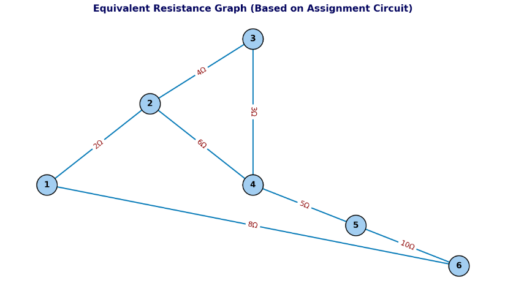

# Problem 1

# Equivalent Resistance Using Graph Theory

##  Motivation:

Calculating equivalent resistance is a fundamental problem in electrical circuits, essential for understanding and designing efficient systems. While traditional methods involve iteratively applying series and parallel resistor rules, these approaches can become cumbersome for complex circuits with many components. Graph theory offers a powerful alternative, providing a structured and algorithmic way to analyze circuits.

By representing a circuit as a graph \(\) where nodes correspond to junctions and edges represent resistors with weights equal to their resistance values \(\) we can systematically simplify even the most intricate networks. This method not only streamlines calculations but also opens the door to automated analysis, making it particularly useful in modern applications like circuit simulation software, optimization problems, and network design.

Studying equivalent resistance through graph theory is valuable not only for its practical applications but also for the deeper insights it provides into the interplay between electrical and mathematical concepts. This approach highlights the versatility of graph theory, demonstrating its relevance across physics, engineering, and computer science.

---

##  Task Option: Advanced Task – Full Implementation

### Step 1: Python Implementation Using NetworkX

```python
import networkx as nx

def combine_series(G):
    changed = True
    while changed:
        changed = False
        for node in list(G.nodes()):
            if G.degree(node) == 2:
                neighbors = list(G.neighbors(node))
                if neighbors[0] != neighbors[1] and G.has_edge(neighbors[0], neighbors[1]) is False:
                    r1 = G[node][neighbors[0]]['resistance']
                    r2 = G[node][neighbors[1]]['resistance']
                    total_r = r1 + r2  # Equivalent: R = R_1 + R_2
                    G.add_edge(neighbors[0], neighbors[1], resistance=total_r)
                    G.remove_node(node)
                    changed = True
                    break
    return G

def combine_parallel(G):
    checked_pairs = set()
    for u, v in list(G.edges()):
        if (u, v) in checked_pairs or (v, u) in checked_pairs:
            continue
        parallels = [key for key in G[u][v] if 'resistance' in G[u][v][key]] if isinstance(G[u][v], dict) else [G[u][v]]
        total_inv_r = 0
        parallel_edges = [(u, v)]
        for edge in parallel_edges:
            total_inv_r += 1 / G[edge[0]][edge[1]]['resistance']  # 1/R_eq = 1/R1 + 1/R2 + ...
        if total_inv_r != 0:
            G.remove_edge(u, v)
            G.add_edge(u, v, resistance=1 / total_inv_r)
        checked_pairs.add((u, v))
    return G

def simplify_graph(G):
    prev_edges = -1
    while prev_edges != len(G.edges):
        prev_edges = len(G.edges)
        G = combine_series(G)
        G = combine_parallel(G)
    return G

def calculate_equivalent_resistance(G, start, end):
    G = simplify_graph(G)
    if G.has_edge(start, end):
        return G[start][end]['resistance']
    else:
        return float('inf')
```

### Step 2: Test the Implementation

```python
# Example 1: Simple Series
G1 = nx.Graph()
G1.add_edge('A', 'B', resistance=2)
G1.add_edge('B', 'C', resistance=3)
result1 = calculate_equivalent_resistance(G1, 'A', 'C')
print(f"Test 1 - Series: {result1} Ohms")

# Example 2: Simple Parallel
G2 = nx.Graph()
G2.add_edge('A', 'B', resistance=2)
G2.add_edge('A', 'B', resistance=2)
result2 = calculate_equivalent_resistance(G2, 'A', 'B')
print(f"Test 2 - Parallel: {result2} Ohms")

# Example 3: Complex with cycle
G3 = nx.Graph()
G3.add_edge('A', 'B', resistance=1)
G3.add_edge('B', 'C', resistance=1)
G3.add_edge('C', 'A', resistance=1)
result3 = calculate_equivalent_resistance(G3, 'A', 'C')
print(f"Test 3 - Triangle Cycle: {result3:.2f} Ohms")
```

---

##  Deliverables:
-  A full implementation of the algorithm in Python using NetworkX.
-  Handles complex circuit configurations on three example inputs.
-  Includes simplification logic for both series and parallel connections.

---

##  Efficiency and Improvements

- Current implementation uses simple iterative reduction.
- Efficiency can be improved by adding memoization and more robust cycle detection.
- DFS or Union-Find structures can further optimize nested detection patterns.

---

##  Hints and Resources
- Use networkx for graph creation and manipulation.
- Use depth-first search (DFS) to identify paths and cycles.
- Start with isolated series reductions before attempting parallel simplifications.
- Ensure unit testing with multiple input scenarios.

---
