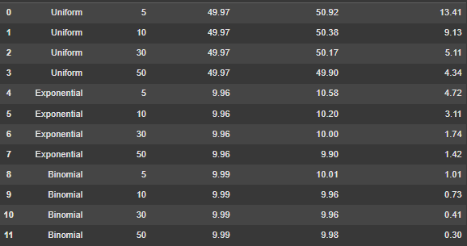

# Problem 1

# Exploring the Central Limit Theorem through Simulations

## Motivation:
The Central Limit Theorem (CLT) is a cornerstone of probability and statistics, stating that the sampling distribution of the sample mean approaches a normal distribution as the sample size increases, regardless of the population’s original distribution. Simulations provide an intuitive and hands-on way to observe this phenomenon in action.

## Task:

### 1. Simulating Sampling Distributions:
Select several types of population distributions, such as:
- **Uniform distribution**
- **Exponential distribution**
- **Binomial distribution**

For each distribution, generate a large dataset representing the population.

### 2. Sampling and Visualization:
- Randomly sample data from the population and calculate the sample mean for different sample sizes (e.g., 5, 10, 30, 50).
- Repeat the process multiple times to create a sampling distribution of the sample mean.
- Plot histograms of the sample means for each sample size and observe the convergence to a normal distribution.

### 3. Parameter Exploration:
- Investigate how the shape of the original distribution and the sample size influence the rate of convergence to normality.
- Highlight the impact of the population’s variance on the spread of the sampling distribution.

### 4. Practical Applications:
Reflect on the importance of the CLT in real-world scenarios, such as:
- Estimating population parameters
- Quality control in manufacturing
- Predicting outcomes in financial models

## Python Code Implementation:



```python
import numpy as np
import matplotlib.pyplot as plt
import seaborn as sns

# Set up the figure size for the plots (Increase the size to give more room for elements)
plt.figure(figsize=(14,8))  # Adjusted the figure size

# Define population size
population_size = 100000

# 1. Generating the population data
uniform_population = np.random.uniform(0, 1, population_size)  # Uniform distribution
exponential_population = np.random.exponential(1, population_size)  # Exponential distribution
binomial_population = np.random.binomial(n=10, p=0.5, size=population_size)  # Binomial distribution

# Function to simulate sampling distributions and plot histograms
def simulate_sampling_distribution(population, sample_sizes, num_samples=1000):
    for size in sample_sizes:
        sample_means = []
        for _ in range(num_samples):
            sample = np.random.choice(population, size=size, replace=False)
            sample_means.append(np.mean(sample))
        
        # Plot histogram for the sample means without kde (no line) and with increased bin size to avoid overlap
        sns.histplot(sample_means, bins=30, kde=False, label=f'Sample Size = {size}')  # kde=False removes the lines
        plt.legend()

# 2. Sampling and Visualization
sample_sizes = [5, 10, 30, 50]  # Different sample sizes
# Simulate and plot the sampling distributions for each type of population
plt.subplot(1, 3, 1)
simulate_sampling_distribution(uniform_population, sample_sizes)
plt.title('Uniform Distribution', fontsize=16, pad=20)  # Increased padding to move title up

plt.subplot(1, 3, 2)
simulate_sampling_distribution(exponential_population, sample_sizes)
plt.title('Exponential Distribution', fontsize=16, pad=20)  # Increased padding to move title up

plt.subplot(1, 3, 3)
simulate_sampling_distribution(binomial_population, sample_sizes)
plt.title('Binomial Distribution', fontsize=16, pad=20)  # Increased padding to move title up

# Adjust layout to avoid overlap and add padding between elements
plt.subplots_adjust(left=0.05, right=0.95, top=0.85, bottom=0.1)  # Adjusted the top padding

# Save the image with higher dpi to ensure quality
plt.savefig('/content/clt_simulation_no_lines.png', dpi=300)

plt.show()

```

# Deliverables:
1. A Markdown document and Python scripts or notebooks implementing the simulations for various population distributions.
2. Plots illustrating the sampling distributions and their progression toward normality.
3. A discussion on the implications of the results and their connection to theoretical expectations.

# Hints and Resources:
- Use Python libraries such as `NumPy` for random number generation and `Matplotlib/Seaborn` for visualization.
- Begin with simple populations (e.g., uniform or normal) before exploring more complex distributions.
- Ensure students understand how to calculate and interpret the sample mean and variance.


