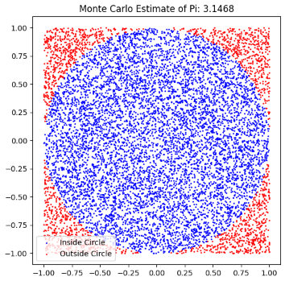

# Problem 2

# Estimating Pi using Monte Carlo Methods

## Motivation:
Monte Carlo simulations are a powerful class of computational techniques that use randomness to solve problems or estimate values. One of the most elegant applications of Monte Carlo methods is estimating the value of $\pi$ through geometric probability. By randomly generating points and analyzing their positions relative to a geometric shape, we can approximate $\pi$ in an intuitive and visually engaging way.

This problem connects fundamental concepts of probability, geometry, and numerical computation. It also provides a gateway to understanding how randomness can be harnessed to solve complex problems in physics, finance, and computer science. The Monte Carlo approach to $\pi$ estimation highlights the versatility and simplicity of this method while offering practical insights into convergence rates and computational efficiency.

---

## Task

### Part 1: Estimating $\pi$ using a circle

### 1. Theoretical Foundation:
- Explain how the ratio of points inside a circle to the total number of points in a square can be used to estimate $\pi$.
- Derive the formula:
  $$ \pi \approx 4 \times \frac{\text{points inside the circle}}{\text{total points}} $$

### 2. Simulation:
- Generate random points in a 2D square bounding a unit circle.
- Count the number of points falling inside the circle.
- Estimate $\pi$ based on the ratio of points inside the circle to the total points.

### 3. Visualization:
- Create a plot showing the randomly generated points, distinguishing those inside and outside the circle.

### 4. Analysis:
- Investigate how the accuracy of the estimate improves as the number of points increases.
- Discuss the convergence rate and computational considerations for this method.

---

### Part 2: Buffon’s Needle Problem

### 1. Theoretical Foundation:
- Describe Buffon’s Needle problem, where $\pi$ can be estimated based on the probability of a needle crossing parallel lines on a plane.
- Derive the formula:
  $$ \pi \approx \frac{2 \times \text{needle length} \times \text{number of throws}}{\text{distance between lines} \times \text{number of crossings}} $$

### 2. Simulation:
- Simulate the random dropping of a needle on a plane with parallel lines.
- Count the number of times the needle crosses a line.
- Estimate $\pi$ based on the derived formula.

### 3. Visualization:
- Create a graphical representation of the simulation, showing the needle positions relative to the lines.

### 4. Analysis:
- Explore how the number of needle drops affects the estimate's accuracy.
- Compare the convergence rate of this method to the circle-based approach.


---

## Python Code for Circle-based Monte Carlo Method:



```python
import numpy as np
import matplotlib.pyplot as plt

# Number of random points
n_points = 10000

# Generate random points
x = np.random.uniform(-1, 1, n_points)
y = np.random.uniform(-1, 1, n_points)

# Calculate the number of points inside the circle
inside_circle = (x**2 + y**2) <= 1
n_inside = np.sum(inside_circle)

# Estimate pi
pi_estimate = 4 * n_inside / n_points

# Visualization
plt.figure(figsize=(6,6))
plt.scatter(x[inside_circle], y[inside_circle], color='blue', s=1, label='Inside Circle')
plt.scatter(x[~inside_circle], y[~inside_circle], color='red', s=1, label='Outside Circle')
plt.gca().set_aspect('equal', adjustable='box')
plt.title(f"Monte Carlo Estimate of Pi: {pi_estimate}")
plt.legend()
plt.show()

print(f"Estimated value of Pi: {pi_estimate}")
```

---


## Deliverables

1. A Markdown document with:
   - Clear explanations of the methods and formulas.
   - A discussion of theoretical foundations and results.

2. Python scripts or notebooks implementing the simulations, including:
   - Code for the circle-based Monte Carlo method.
   - Code for the Buffon’s Needle method.

3. Graphical outputs:
   - Plots showing random points for the circle-based method.
   - Visualizations of needle positions for Buffon’s Needle.

4. Analysis:
   - Tables or graphs showing the convergence of estimated $\pi$ as a function of the number of iterations for both methods.
   - A comparison of the methods in terms of accuracy and computational efficiency.

---

## Hints and Resources

- Use Python libraries such as NumPy for random number generation and Matplotlib for visualizations.
- For the circle-based method, ensure the random points are uniformly distributed within the square.
- For Buffon’s Needle, pay attention to geometric constraints, such as the relationship between the needle length and the distance between lines.
- Start with a small number of iterations to validate the implementation, then increase the sample size to observe convergence.
