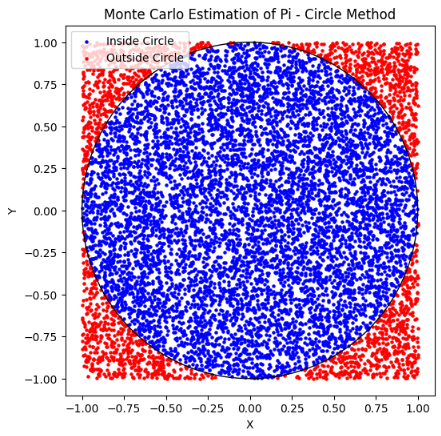

# Problem 2

# Estimating Pi using Monte Carlo Methods

---

## Motivation

Monte Carlo simulations are a powerful class of computational techniques that use randomness to solve problems or estimate values. One of the most elegant applications of Monte Carlo methods is estimating the value of $\pi$ through geometric probability. By randomly generating points and analyzing their positions relative to a geometric shape, we can approximate $\pi$ in an intuitive and visually engaging way.

This problem connects fundamental concepts of probability, geometry, and numerical computation. It also provides a gateway to understanding how randomness can be harnessed to solve complex problems in physics, finance, and computer science. The Monte Carlo approach to $\pi$ estimation highlights the versatility and simplicity of this method while offering practical insights into convergence rates and computational efficiency.

---

## Part 1: Estimating $\pi$ using a Circle

### 1. Theoretical Foundation

- Explain how the ratio of points inside a circle to the total number of points in a square can be used to estimate $\pi$.

- Derive the formula

$$
\pi \approx 4 \times \frac{\text{points inside the circle}}{\text{total points}}
$$

for a unit circle.

### 2. Simulation

- Generate random points in a 2D square bounding a unit circle.

- Count the number of points falling inside the circle.

- Estimate $\pi$ based on the ratio of points inside the circle to the total points.

### 3. Visualization

- Create a plot showing the randomly generated points, distinguishing those inside and outside the circle.

### 4. Analysis

- Investigate how the accuracy of the estimate improves as the number of points increases.

- Discuss the convergence rate and computational considerations for this method.

---

## Part 2: Estimating $\pi$ using Buffon's Needle

### 1. Theoretical Foundation

- Describe Buffon's Needle problem, where $\pi$ can be estimated based on the probability of a needle crossing parallel lines on a plane.

- Derive the formula:

$$
\pi \approx \frac{2 \times \text{needle length} \times \text{number of throws}}{\text{distance between lines} \times \text{number of crossings}}
$$

### 2. Simulation

- Simulate the random dropping of a needle on a plane with parallel lines.

- Count the number of times the needle crosses a line.

- Estimate $\pi$ based on the derived formula.

### 3. Visualization

- Create a graphical representation of the simulation, showing the needle positions relative to the lines.

### 4. Analysis

- Explore how the number of needle drops affects the estimate's accuracy.

- Compare the convergence rate of this method to the circle-based approach.

---

## Deliverables

1. A Markdown document with:

   - Clear explanations of the methods and formulas.

   - A discussion of theoretical foundations and results.

2. Python scripts or notebooks implementing the simulations, including:

   - Code for the circle-based Monte Carlo method.

   - Code for Buffon's Needle method.

3. Graphical outputs:

   - Plots showing random points for the circle-based method.

   - Visualizations of needle positions for Buffon's Needle.

4. Analysis:

   - Tables or graphs showing the convergence of estimated $\pi$ as a function of the number of iterations for both methods.

   - A comparison of the methods in terms of accuracy and computational efficiency.

---

## Hints and Resources

- Use Python libraries such as NumPy for random number generation and Matplotlib for visualizations.

- For the circle-based method, ensure the random points are uniformly distributed within the square.

- For Buffon's Needle, pay attention to geometric constraints, such as the relationship between the needle length and the distance between lines.

- Start with a small number of iterations to validate the implementation, then increase the sample size to observe convergence.

---

## Python Code



```python
import numpy as np
import matplotlib.pyplot as plt

def estimate_pi_circle(num_points):
    """
    Estimate pi using the Monte Carlo method with random points inside a square.
    Points inside the unit circle are counted to estimate pi.

    Args:
        num_points (int): Number of random points to generate.

    Returns:
        pi_estimate (float): Estimated value of pi.
        points (ndarray): Generated points (num_points x 2).
        inside_mask (ndarray): Boolean mask for points inside the circle.
    """
    # Generate random points in the square [-1, 1] x [-1, 1]
    points = np.random.uniform(low=-1, high=1, size=(num_points, 2))

    # Calculate distances from origin (0,0)
    distances = np.linalg.norm(points, axis=1)

    # Mask for points inside the unit circle (distance <= 1)
    inside_mask = distances <= 1

    # Estimate pi using ratio of points inside circle
    pi_estimate = 4 * np.sum(inside_mask) / num_points

    return pi_estimate, points, inside_mask

def plot_circle_simulation(points, inside_mask):
    """
    Plot the points generated for circle-based Monte Carlo simulation.

    Args:
        points (ndarray): Array of points (num_points x 2).
        inside_mask (ndarray): Boolean mask for points inside the circle.
    """
    plt.figure(figsize=(6,6))
    plt.scatter(points[inside_mask, 0], points[inside_mask, 1], color='blue', s=5, label='Inside Circle')
    plt.scatter(points[~inside_mask, 0], points[~inside_mask, 1], color='red', s=5, label='Outside Circle')
    circle = plt.Circle((0, 0), 1, color='black', fill=False, linewidth=1)
    plt.gca().add_artist(circle)
    plt.title('Monte Carlo Estimation of Pi - Circle Method')
    plt.xlabel('X')
    plt.ylabel('Y')
    plt.legend()
    plt.axis('square')
    plt.show()

def estimate_pi_buffon(num_throws, needle_length=1, line_distance=1):
    """
    Estimate pi using Buffon's Needle experiment.

    Args:
        num_throws (int): Number of needle drops.
        needle_length (float): Length of the needle.
        line_distance (float): Distance between parallel lines.

    Returns:
        pi_estimate (float): Estimated value of pi.
        crosses (int): Number of times needle crosses a line.
        needles (list of tuples): List of needle positions for visualization.
            Each needle is ((x_center, y_center), angle)
    """
    crosses = 0
    needles = []

    for _ in range(num_throws):
        # Random position of needle center between 0 and line_distance / 2
        center_y = np.random.uniform(0, line_distance / 2)

        # Random angle of needle with respect to the lines [0, pi/2]
        angle = np.random.uniform(0, np.pi / 2)

        # Calculate vertical projection of half needle length
        half_proj = (needle_length / 2) * np.sin(angle)

        # Check if needle crosses a line
        if center_y <= half_proj:
            crosses += 1

        needles.append(((0, center_y), angle))

    if crosses == 0:
        # Avoid division by zero
        pi_estimate = np.nan
    else:
        pi_estimate = (2 * needle_length * num_throws) / (line_distance * crosses)

    return pi_estimate, crosses, needles

def plot_buffon_needles(needles, needle_length=1, line_distance=1, num_lines=5):
    """
    Visualize Buffon's Needle simulation.

    Args:
        needles (list): List of needle positions ((x_center, y_center), angle).
        needle_length (float): Length of needles.
        line_distance (float): Distance between parallel lines.
        num_lines (int): Number of parallel lines to draw.
    """
    plt.figure(figsize=(8, 6))

    # Draw parallel lines
    for i in range(num_lines):
        y = i * line_distance
        plt.axhline(y=y, color='black', linewidth=1)

    # Plot needles
    for (x_center, y_center), angle in needles:
        x_start = x_center - (needle_length / 2) * np.cos(angle)
        x_end = x_center + (needle_length / 2) * np.cos(angle)
        y_start = y_center - (needle_length / 2) * np.sin(angle)
        y_end = y_center + (needle_length / 2) * np.sin(angle)
        plt.plot([x_start, x_end], [y_start, y_end], 'r-', alpha=0.6)

    plt.title("Buffon's Needle Simulation")
    plt.xlabel('X')
    plt.ylabel('Y')
    plt.ylim(-line_distance, line_distance * num_lines)
    plt.xlim(-needle_length, needle_length)
    plt.gca().set_aspect('equal')
    plt.show()

def convergence_analysis_circle(max_points=100000, step=5000):
    """
    Analyze convergence of pi estimation using circle method.

    Args:
        max_points (int): Maximum number of points.
        step (int): Step size for iterations.

    Returns:
        points_list (list): Number of points used.
        pi_estimates (list): Corresponding pi estimates.
    """
    points_list = []
    pi_estimates = []

    for n in range(step, max_points + 1, step):
        pi_est, _, _ = estimate_pi_circle(n)
        points_list.append(n)
        pi_estimates.append(pi_est)

    return points_list, pi_estimates

def convergence_analysis_buffon(max_throws=100000, step=5000):
    """
    Analyze convergence of pi estimation using Buffon's Needle method.

    Args:
        max_throws (int): Maximum number of needle throws.
        step (int): Step size for iterations.

    Returns:
        throws_list (list): Number of throws used.
        pi_estimates (list): Corresponding pi estimates.
    """
    throws_list = []
    pi_estimates = []

    for n in range(step, max_throws + 1, step):
        pi_est, crosses, _ = estimate_pi_buffon(n)
        throws_list.append(n)
        pi_estimates.append(pi_est)

    return throws_list, pi_estimates

def plot_convergence(points_list, pi_estimates, throws_list, pi_estimates_buffon):
    """
    Plot convergence of pi estimates for both methods.

    Args:
        points_list (list): Number of points for circle method.
        pi_estimates (list): Pi estimates for circle method.
        throws_list (list): Number of throws for Buffon's method.
        pi_estimates_buffon (list): Pi estimates for Buffon's method.
    """
    plt.figure(figsize=(10,6))
    plt.plot(points_list, pi_estimates, label='Circle Method')
    plt.plot(throws_list, pi_estimates_buffon, label="Buffon's Needle Method")
    plt.axhline(y=np.pi, color='black', linestyle='--', label='True Pi')
    plt.xlabel('Number of Iterations')
    plt.ylabel('Estimated Pi')
    plt.title('Convergence of Pi Estimates')
    plt.legend()
    plt.show()

if __name__ == "__main__":
    # Test and visualize circle method
    n_points = 10000
    pi_est, pts, mask = estimate_pi_circle(n_points)
    print(f"Circle Method: Estimated Pi = {pi_est:.6f} with {n_points} points")
    plot_circle_simulation(pts, mask)

    # Test and visualize Buffon's Needle method
    n_throws = 10000
    pi_est_b, crosses, needles = estimate_pi_buffon(n_throws)
    print(f"Buffon's Needle Method: Estimated Pi = {pi_est_b:.6f} with {n_throws} throws and {crosses} crosses")
    plot_buffon_needles(needles[:100], needle_length=1, line_distance=1)

    # Convergence analysis
    circle_points, circle_pis = convergence_analysis_circle(max_points=50000, step=5000)
    buffon_throws, buffon_pis = convergence_analysis_buffon(max_throws=50000, step=5000)

    plot_convergence(circle_points, circle_pis, buffon_throws, buffon_pis)

```


