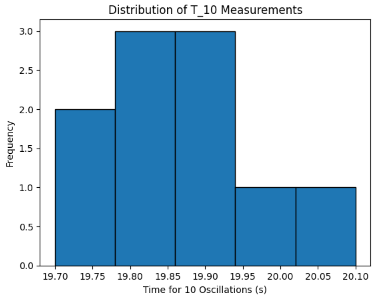

# Problem 1

# Measuring Earth's Gravitational Acceleration with a Pendulum

## Motivation:

The acceleration **$g$** due to gravity is a fundamental constant that influences a wide range of physical phenomena. Measuring **$g$** accurately is crucial for understanding gravitational interactions, designing structures, and conducting experiments in various fields. One classic method for determining **$g$** is through the oscillations of a simple pendulum, where the period of oscillation depends on the local gravitational field.

## Task:

Measure the acceleration **$g$** due to gravity using a pendulum and analyze the uncertainties in the measurements in detail.

This exercise emphasizes rigorous measurement practices, uncertainty analysis, and their role in experimental physics.

## Procedure:

### 1. Materials:
- A string (1 or 1.5 meters long).
- A small weight (e.g., bag of coins, bag of sugar, key chain) mounted on the string.
- Stopwatch (or smartphone timer).
- Ruler or measuring tape.

### 2. Setup:
- Attach the weight to the string and fix the other end to a sturdy support.
- Measure the length of the pendulum, $L$, from the suspension point to the center of the weight using a ruler or measuring tape. Record the resolution of the measuring tool and calculate the uncertainty as half the resolution:
  
$$
\Delta L = \frac{\text{Ruler Resolution}}{2}
$$

### 3. Data Collection:
- Displace the pendulum slightly (<15°) and release it.
- Measure the time for 10 full oscillations ($T_{10}$) and repeat this process 10 times. Record all 10 measurements.
- Calculate the mean time for 10 oscillations ($\overline{T}_{10}$) and the standard deviation ($\sigma_{T}$).
- Determine the uncertainty in the mean time as:

$$
\Delta T_{10} = \frac{\sigma_{T}}{\sqrt{n}}
$$

where $n = 10$.

## Calculations:

1. Calculate the period:

$$
T = \frac{\overline{T}_{10}}{10} \quad \text{and} \quad \Delta T = \frac{\Delta T_{10}}{10}
$$

2. Determine $g$:

$$
g = \frac{4 \pi^2 L}{T^2}
$$

3. Propagate uncertainties:

$$
\Delta g = g \sqrt{\left(\frac{\Delta L}{L}\right)^2 + \left(2 \frac{\Delta T}{T}\right)^2}
$$

## Analysis:

1. Compare your measured $g$ with the standard value $(9.81 \, m/s^2)$.

2. Discuss:
- The effect of measurement resolution on $\Delta L$.
- Variability in timing and its impact on $\Delta T$.
- Any assumptions or experimental limitations.

## Deliverables:

1. Tabulated data in markdown:
- $L$, $\Delta L$, $T_{10}$ measurements, $\overline{T}_{10}$, $\sigma_T$, $\Delta T$.
- Calculated $g$ and $\Delta g$.

2. Discussion on sources of uncertainty and their impact on results.

---

# Python Code



```python
import numpy as np
import pandas as pd

# Constants
pi = np.pi

# Given parameters
L = 1.0  # length of pendulum in meters (can be 1 or 1.5 as per setup)
ruler_resolution = 0.001  # ruler resolution in meters (1 mm)
delta_L = ruler_resolution / 2  # uncertainty in length

# Number of measurements
n = 10

# Simulate 10 measurements of time for 10 oscillations (seconds)
# Let's simulate realistic values around the theoretical period for a pendulum of length L

# Theoretical period for 1 oscillation:
T_theoretical = 2 * pi * np.sqrt(L / 9.81)  # seconds

# Time for 10 oscillations:
T10_theoretical = 10 * T_theoretical

# Simulate measured times with some random noise to represent measurement variability
np.random.seed(42)  # for reproducibility
# Assume standard deviation of measurement ~0.05 seconds for T10
sigma_T_meas = 0.05

T10_measurements = np.random.normal(loc=T10_theoretical, scale=sigma_T_meas, size=n)

# Calculate mean and standard deviation
T10_mean = np.mean(T10_measurements)
sigma_T = np.std(T10_measurements, ddof=1)

# Uncertainty in mean time
delta_T10 = sigma_T / np.sqrt(n)

# Calculate period and uncertainty for one oscillation
T = T10_mean / 10
delta_T = delta_T10 / 10

# Calculate g and its uncertainty
g = 4 * pi**2 * L / T**2
delta_g = g * np.sqrt((delta_L / L)**2 + (2 * delta_T / T)**2)

# Prepare data for display
data = {
    'T10_measurements (s)': T10_measurements,
    'L (m)': [L]*n,
    'ΔL (m)': [delta_L]*n
}

df = pd.DataFrame(data)

# Summary calculations
summary = {
    'Mean T10 (s)': T10_mean,
    'Std Dev σ_T (s)': sigma_T,
    'Uncertainty ΔT10 (s)': delta_T10,
    'Period T (s)': T,
    'Uncertainty ΔT (s)': delta_T,
    'Measured g (m/s^2)': g,
    'Uncertainty Δg (m/s^2)': delta_g,
    'Standard g (m/s^2)': 9.81,
    'Difference from standard (m/s^2)': g - 9.81
}

# Print results
print("\n--- Pendulum Gravity Measurement Data ---\n")
print(df.to_markdown(index=False))

print("\n--- Summary ---\n")
for key, value in summary.items():
    print(f"{key}: {value:.5f}")

# Markdown formatted summary for report
markdown_summary = "\n".join([f"- **{key}**: {value:.5f}" for key, value in summary.items()])
print("\n--- Markdown summary for report ---\n")
print(markdown_summary)

```